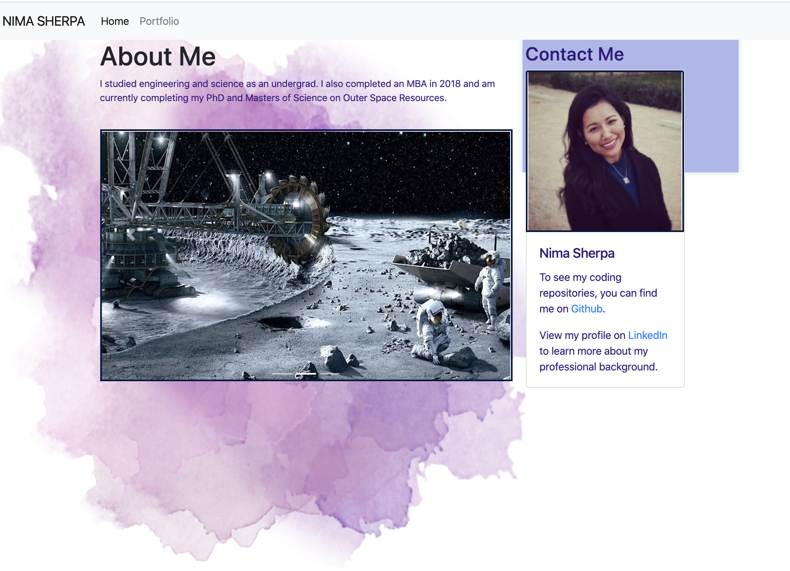

# 20200418updatedprofile
An Updated portfolio page given work done to date.

Unit 08 Project 1 Homework: Professional Materials
Now that you've had some practice with APIs and have a project to share, you'll be updating your portfolio page and other materials to build toward being employer competitive.
If you are opting out of career services, this is still a required assignment. Part of being a web developer means being a part of a community. Having a place to share your projects is necessary if you're applying for jobs, but is still critical on your journey as a developer.

Requirements

*Updated portfolio featuring project 1 and two exemplary homework assignments.
*Update GitHub profile with pinned repositories featuring project 1 and two exemplary assignments.
*Updated resume
*Updated LinkedIn profile

